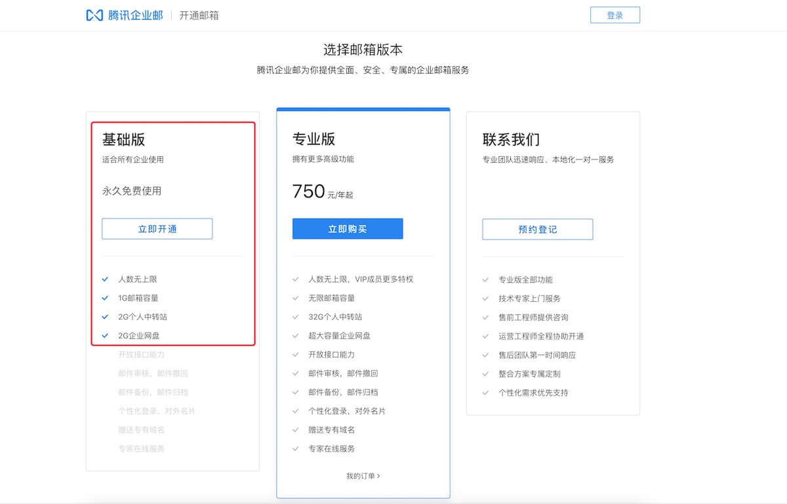
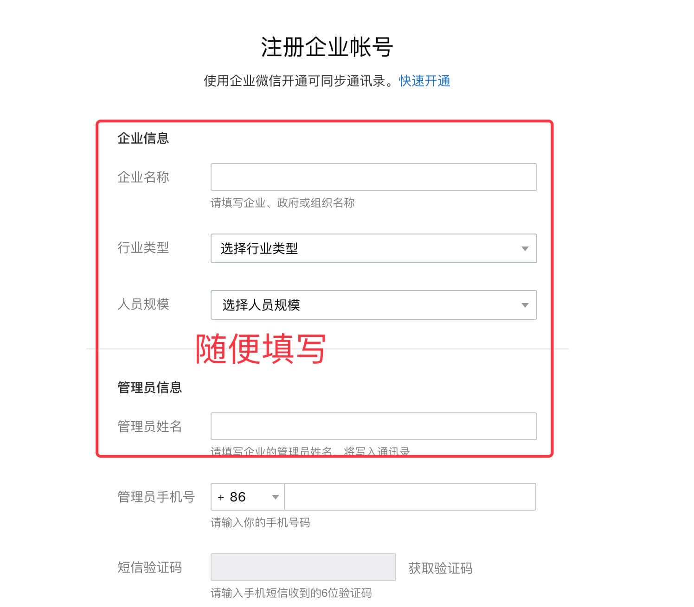
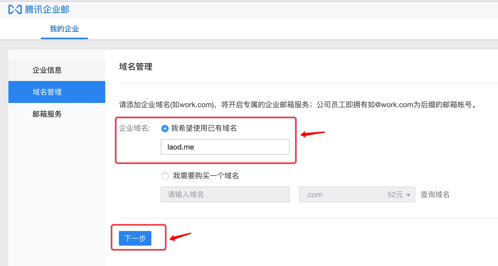
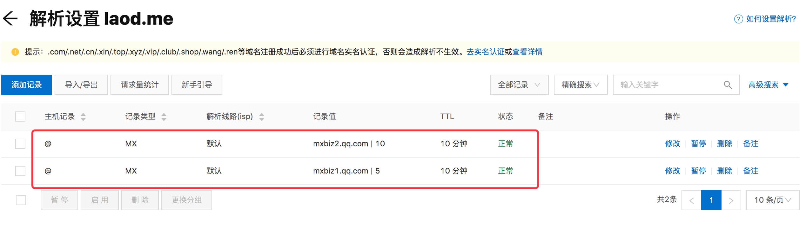
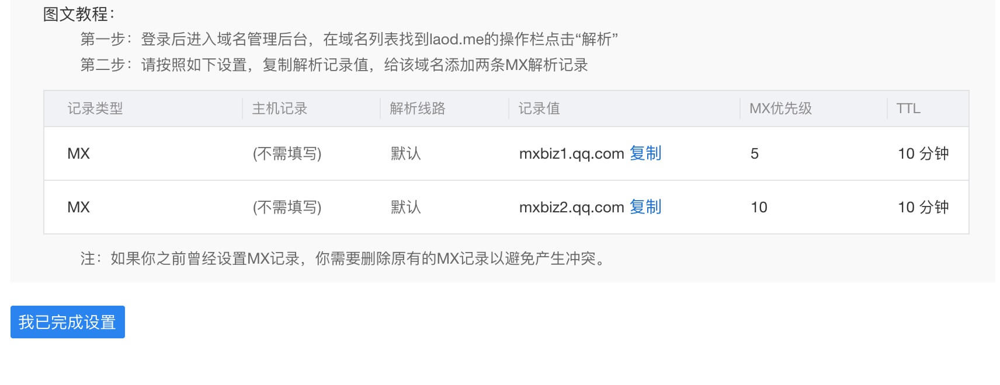
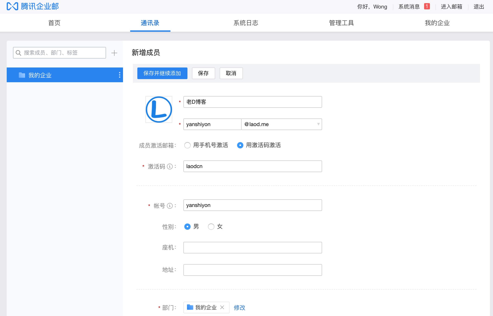
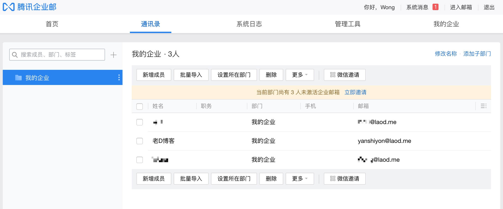
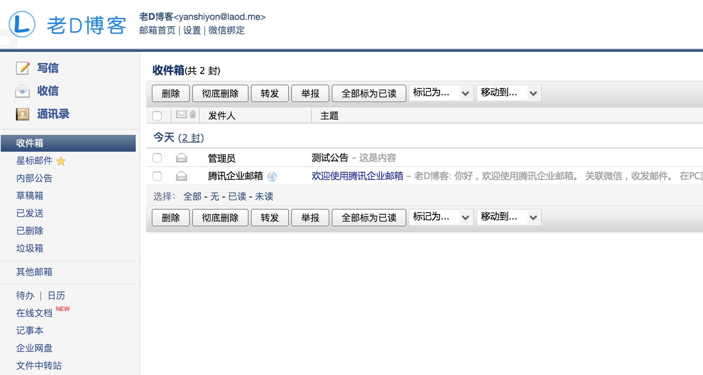

# 免费搭建属于自己的域名个性邮箱

 2019-10-13*15:02:35*[ 评论](https://laod.cn/tools/yumingyouxiang.html#respond) 4,516

拥有一个自定义邮箱是一件很酷的事情，比起大家经常用的163.com，qq.com等后缀名称的邮箱更能引起人的注意，是个人站长以及想要追求个性化的童鞋的不二选择。

以前老D用过@laod.cn作为自己的后缀邮箱，由于使用cn域名的一些历史原因。

> 具体就是cn一级域名「laod.cn是一级域名，而带www的www.laod.cn是二级域名」用作博客域名，又用了CDN服务，导致[域名邮箱](https://laod.cn/tag/域名邮箱/)无法解析。

所以就有了今天的这篇文章，再次弄一个自己的域名邮箱。

 

国内市面上可以用于免费的企业邮箱服务也就只有几个大厂，用这些邮箱服务也必须用大厂。

比如：

1.[腾讯企业邮](https://laod.cn/wp-content/themes/begin/go.php?url=aHR0cHM6Ly9leG1haWwucXEuY29tL29ubGluZXNlbGwvaW50cm8=)（**推荐**）
2.[网易企业邮](https://laod.cn/wp-content/themes/begin/go.php?url=aHR0cDovL3ltLjE2My5jb20v)（推荐）
3.[新浪企业邮箱](https://laod.cn/wp-content/themes/begin/go.php?url=aHR0cHM6Ly9tYWlsLnNpbmEubmV0L2h1b2Rvbmcvc2VsZnNlcnZpY2UvaW5kZXgucGhwP3M9NTBiOGUxMzY3ZmE4OTBkOGI5YTdlMThhY2U4NGNiMTczNTZlNjUyZl8xNzQ=)
4.[阿里企业邮](https://laod.cn/wp-content/themes/begin/go.php?url=aHR0cHM6Ly9xaXllLmFsaXl1bi5jb20v) 只能免费5年，但是服务还不错。

**当然，自己在自己的服务器上也是可以搭建免费的邮箱系统的，但是咱们并不能保证它稳定的一直运行啊。**

这里主要教大家如何用腾讯的企业邮箱建立自己域名的邮箱，因为腾讯企业邮箱好处很多，能用微信收发，无需安装App，腾讯企业邮箱小程序随时随地收发邮件等，支持微信扫一扫登录，无需登录密码，更加安全便捷。

 

## 购买域名

既然是域名邮箱当然首先要有自己的域名，购买域名地址可以去腾讯云或者阿里云,这里就不多介绍了。

 

## 腾讯企业邮箱注册

域名购买之后进入腾讯企业邮箱注册，网址：[https://exmail.qq.com/onlinesell/intro](https://laod.cn/wp-content/themes/begin/go.php?url=aHR0cHM6Ly93d3cuaHVyYmFpLmNvbS9leHQvbGluay8/dXJsPWh0dHBzOi8vZXhtYWlsLnFxLmNvbS9vbmxpbmVzZWxsL2ludHJv)，进入网址，然后选择**免费版**。

 

这里的信息有的随便填写就行，然后点击**注册**。

注册后也可以再修改。

 

注册成功后进入后台，点击域名管理，然后添加自己的域名，然后按照上面方法解析域名，解析成功后即可。

 

比如域名是阿里云注册的，那么你就进阿里云域名控制台设置MX解析。

 

设置MX解析完成后，点击【我已完成设置】

 

## 添加成员

域名解析成功后就可以去添加成员了，点击**通讯录**就能看到添加成员按钮。

可以根据自己的喜爱自定义邮箱前缀，一个字母都是可以的，添加好后点击保存。

 

一共可以添加200成员 

## 登录邮箱

添加好后就可以去登录了，登录地址: https://exmail.qq.com

用微信扫码登录，绑定邮箱账号登录，或者使用手机号接收验证码，然后输入验证码就可以了。

## 总结：

网易企业邮箱、阿里企业邮箱以及新浪企业邮箱都是相同的使用方便，有需要也可以去试试。

但是腾讯企业邮箱绑定微信后可在微信小程序**腾讯企业邮箱**中查看收发邮件等操作，这样就不用在另外下载 App 了，这一点还是非常等方便的。

腾讯企业邮箱免费版的容量才有1G，如果你打算经常使用，每天收发的邮件又比较多，这点容量估计够呛。

作为[个性邮箱](https://laod.cn/tag/个性邮箱/)使用还是可以的，作为日常使用，老D还是建议使用Gmail或者微软邮件。

注意：每个微信号只能注册5个管理员。

文章地址：https://laod.cn/tools/yumingyouxiang.html